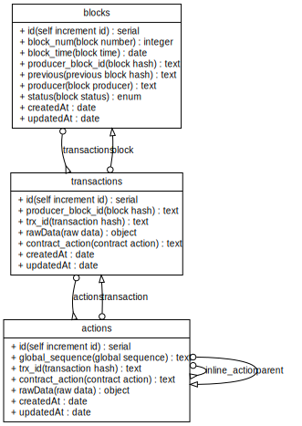

# tpos-tracker

[](https://www.npmjs.com/package/@tpblock/tracker)

tpos-tracker is a TPOS blockchain data API service framework built on the [fib-app](https://github.com/fibjs/fib-app)  framework.

- It offers emitter event listeners for tpos block data.
- It provides an HTTP service that supports GraphQL invocation.
- It supports customization of data models (models) using the ORM approach, allowing for custom data tables and hook listeners.

## Installation

```bash
$ tpos --install @tpblock/tracker
```

## Data Model


